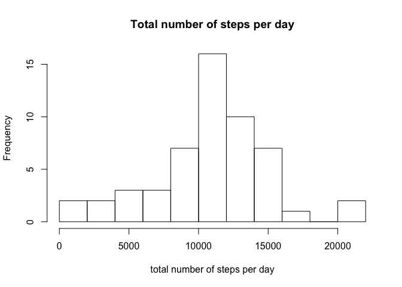
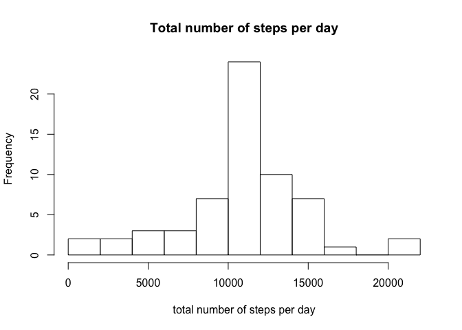

# Reproducible Research: Peer Assessment 1


## Loading and preprocessing the data

Download the data:

```r
fileurl="https://d396qusza40orc.cloudfront.net/repdata%2Fdata%2Factivity.zip"
download.file(fileurl,destfile = "activity.zip")
unzip("activity.zip")
```

Load data into R:

```r
activitydata=read.csv("activity.csv")
head(activitydata)
```

```
##   steps       date interval
## 1    NA 2012-10-01        0
## 2    NA 2012-10-01        5
## 3    NA 2012-10-01       10
## 4    NA 2012-10-01       15
## 5    NA 2012-10-01       20
## 6    NA 2012-10-01       25
```

## What is mean total number of steps taken per day?

Let's first calcuate the total number of steps taken per day. 
The mission values are ignored.

```r
#remove NAs
activitydata2=activitydata[complete.cases(activitydata),]
#caluate the sum of steps per day
totalperday=tapply(activitydata2$steps,activitydata2$date,sum)
```

Here is a histogram of the total number of steps taken each day

```r
hist(totalperday,breaks=10,xlab = "total number of steps per day", main = "Total number of steps per day")
```

 

The mean of the total number of steps taken per day is:

```r
mean_steps=mean(totalperday,na.rm=TRUE)
print(mean_steps)
```

```
## [1] 10766.19
```

The median of the total number of steps taken per day is:

```r
median_steps=median(totalperday,na.rm=TRUE)
print(median_steps)
```

```
## [1] 10765
```

## What is the average daily activity pattern?

Here is a time series plot of the 5-minute interval (x-axis) and the average number of steps taken, averaged across all days (y-axis)

```r
#calculate the average number of steps across all days
activitydata2=transform(activitydata2,interval=factor(interval)) 
average_steps=tapply(activitydata2$steps, activitydata2$interval, mean)
average_steps=unname(average_steps)
dailypattern=data.frame("interval"=activitydata$interval[1:288],"average_steps"=average_steps)
#make the plot
library(lattice)
xyplot(average_steps~interval,data = dailypattern,type="l",xlab = "Interval",ylab ="Number of steps")
```

 

The 5-minute inteval that containing the maxium number of steps,averaged across all days:

```r
max_index=which.max(dailypattern$average_steps)
max_interval=dailypattern[max_index,1]
print(max_interval)
```

```
## [1] 835
```

## Imputing missing values

The total number of missing values in the dataset is:

```r
total_na=sum(!complete.cases(activitydata))
print(total_na)
```

```
## [1] 2304
```

Create a new dataset that is equal to the original dataset but with the missing data filled in with the mean for that 5-minute interval.

```r
new_activity=activitydata
for (i in 1:nrow(new_activity)){
        if (is.na(new_activity$steps[i])){
                j=i%%nrow(average_steps)
                if(j==0){
                        j=nrow(average_steps)
                }
                new_activity$steps[i]=average_steps[j]
        }
}
```

Here is a histogram of the total number of steps taken each day for the new dataset:

```r
#calculate the total number of steps taken each day for the new dataset
new_total_day=tapply(new_activity$steps,new_activity$date,sum)
new_total_day=unname(new_total_day)
#make the histogram
hist(new_total_day,breaks=10,xlab = "total number of steps per day", main = "Total number of steps per day")
```

 
The mean of the total number of steps taken per day for new dataset is:

```r
new_mean_steps=mean(new_total_day)
print(new_mean_steps)
```

```
## [1] 10766.19
```

```r
print("Does the mean differ from the first part of the assignment:") 
```

```
## [1] "Does the mean differ from the first part of the assignment:"
```

```r
print((!new_mean_steps==mean_steps))
```

```
## [1] FALSE
```

The median of the total number of steps taken per day for new dataset is:

```r
new_median_steps=median(new_total_day)
print(new_median_steps)
```

```
## [1] 10766.19
```

```r
print("Does the median differ from the first part of the assignment:") 
```

```
## [1] "Does the median differ from the first part of the assignment:"
```

```r
print((!new_median_steps==median_steps))
```

```
## [1] TRUE
```
The mean and median are the same as estimates from the first part of this assignment.
Imputting missing data only increases the total daily number of steps for the days contraining missing values.

## Are there differences in activity patterns between weekdays and weekends?

Create a new factor variable in the dataset with two levels – “weekday” and “weekend” indicating whether a given date is a weekday or weekend day.

```r
#convert $date from factor to date
new_activity=transform(new_activity,date=as.Date(date)) 
#create weekday variable
new_activity$weekday=weekdays(new_activity$date)
new_activity=transform(new_activity,weekday=factor(weekday))
levels(new_activity$weekday)=c("weekday","weekday","weekend","weekend","weekday","weekday","weekday")
```

Make a panel plot containing a time series plot of the 5-minute interval (x-axis) and the average number of steps taken, averaged across all weekday days or weekend days (y-axis). 

```r
library(dplyr)
```

```
## 
## Attaching package: 'dplyr'
## 
## The following objects are masked from 'package:stats':
## 
##     filter, lag
## 
## The following objects are masked from 'package:base':
## 
##     intersect, setdiff, setequal, union
```

```r
library(lattice)
#filter the data for weekdays and weekends
weekday_activity=filter(new_activity,weekday=="weekday")
weekend_activity=filter(new_activity,weekday=="weekend")
#calcuate daily average steps for weekdays and weekends
weekday_steps=with(weekday_activity,tapply(steps, interval, mean))
weekday_steps=unname(weekday_steps)
weekend_steps=with(weekend_activity,tapply(steps, interval, mean))
weekend_steps=unname(weekend_steps)
weekday_steps=data.frame("interval"=new_activity$interval[1:288],"average_steps"=weekday_steps,"weekday"=factor("weekday"))
weekend_steps=data.frame("interval"=new_activity$interval[1:288],"average_steps"=weekend_steps,"weekday"=factor("weekend"))
#combine weekday and weekend daily steps into one data frame
daily_steps=rbind(weekday_steps,weekend_steps)
#make panel plot
xyplot(average_steps~interval|weekday,data = daily_steps,layout=c(1,2),xlab = "Interval",ylab = "Number of steps",type="l")
```

 
